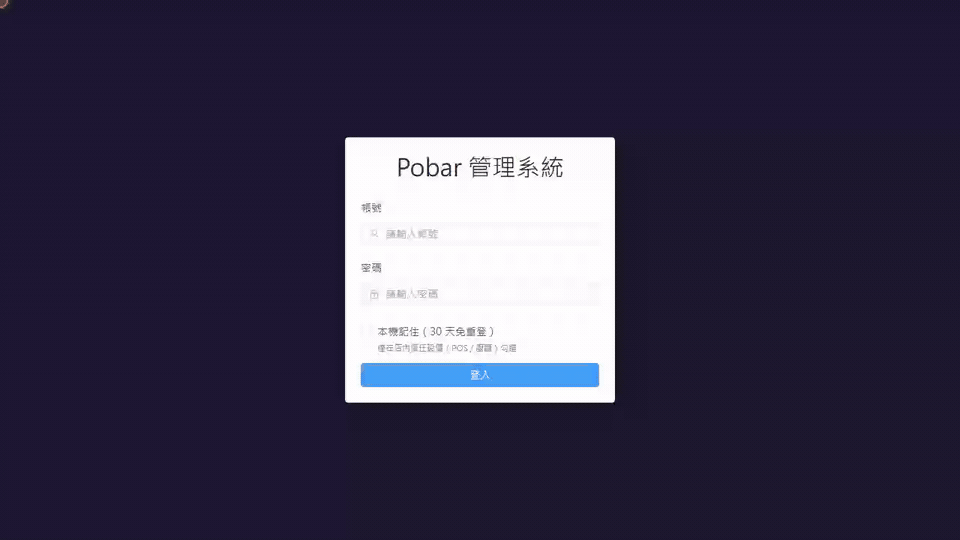
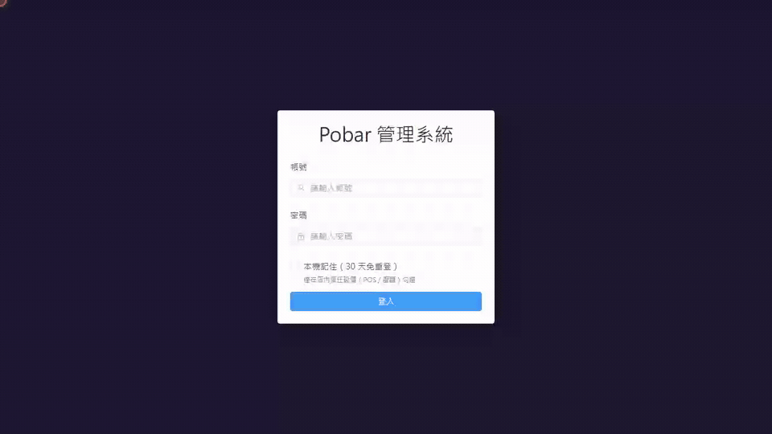

<div align="center">

# 🍹 Pobar 2.0

### 智慧吧台點餐管理系統

全端酒吧管理平台，整合客戶掃碼自助點餐、即時廚房 / 吧台顯示、桌況管理、線上訂位與後台報表，一站式涵蓋完整營運流程。

[](https://spring.io/projects/spring-boot)
[](https://vuejs.org/)
[](https://mysql.com/)
[](https://playwright.dev/)
[](https://docker.com/)

</div>

---

## 目錄

- [Demo](#demo)
- [系統概覽](#系統概覽)
- [角色功能](#角色功能)
  - [👤 客人](#-客人public)
  - [🛎️ 服務生](#️-服務生waiter)
  - [🍸 調酒師](#-調酒師bartender)
  - [👨‍🍳 廚師](#-廚師kitchen)
  - [🔧 管理員](#-管理員admin--manager)
- [自動化測試](#自動化測試)
- [部署說明](#部署說明)
- [本地開發](#本地開發)
- [專案結構](#專案結構)
- [設計文件](#設計文件)

---

## Demo

以下畫面全部由 [Playwright E2E 測試](#自動化測試)實跑真實系統錄製（Nginx + Spring Boot + MySQL 全走 Docker），不是手動示範。
畫面中的**紅色圓點是錄影用的假游標**，點擊時會有漣漪，方便看清每一步操作的位置。

### 👤 顧客掃碼點餐

掃描桌邊 QR Code → 瀏覽酒單 → 開品項詳情、填備註、調數量 → 加入購物車 → 送出訂單。


### 📅 顧客線上訂位

選日期 / 座位區 / 人數 / 時段 → 填姓名電話 → 取得 8 碼訂位代碼 → 以電話＋代碼查詢 → 自助取消。


### 🛎️ 服務生：開桌 → 結帳 → 關桌

點空桌開桌並產生掃碼點餐 QR Code → 查看桌內品項與製作狀態 → 結帳（服務費、付款方式、均攤、電子發票）。



### 🪑 服務生：訂位入座

訂位列表點「入座」→ 勾選桌位（即時顯示容量是否足夠）→ 確認入座並自動開桌，直接彈出點餐 QR Code。



### 📺 出餐看板（廚房 / 吧台）

食物與飲品完全分流，新單透過 WebSocket 即時推送；廚房走「開始製作 → 完成」，吧台一步完成。

<table>
<tr>
<td width="50%" valign="top">
<b>👨‍🍳 廚房（FOOD）</b><br><br>

</td>
<td width="50%" valign="top">
<b>🍸 吧台（DRINK）</b><br><br>

</td>
</tr>
</table>

### 🔧 管理員後台

登入後台 → 導覽營收報表 / 品項 / 桌位 / 食材 / 系統設定 / 員工 → 新增菜單品項。


> GIF 為 8–10 fps、單檔 5 MB 以內的壓縮版本；原始 1280×720 影片與逐步 trace 可用 `npx playwright show-report` 回放。

---

## 系統概覽

| 層級 | 技術 |
|------|------|
| **後端** | Java 17 · Spring Boot 3.0 · Spring Security · MyBatis Plus · JJWT · Bucket4j（限流）· Jsoup（XSS 清洗）· Spring AOP（審計）· Actuator |
| **前端** | Vue 3 · Vite · Pinia · Vue Router · Element Plus · ECharts · vue-i18n（中／英切換） |
| **資料庫** | MySQL 8.0（`sql/init.sql` 一次建好 schema、系統設定、42 款酒單、食材與酒譜種子） |
| **即時通訊** | WebSocket / STOMP over SockJS，斷線自動重連並降級為 30 秒輪詢 |
| **認證** | JWT 雙 Token（Access + Refresh）· BCrypt · 登入失敗鎖定 · Token 黑名單 · 首次登入強制改密 |
| **測試** | Playwright E2E（6 支 spec / 13 個案例，全程錄影 + trace） |
| **容器化** | Docker · Docker Compose（SIT 預設 + prod override）· Nginx 反向代理 |

**角色對應頁面**

| 角色 | 頁面路徑 | 說明 |
|------|----------|------|
| 客人（無帳號） | `/order/:token`、`/reservation` | QR Code 掃碼進入 |
| WAITER | `/staff` | 桌況、結帳、訂位 |
| BARTENDER | `/bar` | 吧台飲品顯示 |
| KITCHEN | `/kitchen` | 廚房食物顯示 |
| MANAGER | `/staff`、`/bar`、`/kitchen`、`/admin/menu`、`/admin/tables`、`/admin/ingredients` | 營運 + 菜單／桌位／食材維護 |
| ADMIN | 全部頁面（另含 `/admin/reports`、`/admin/settings`、`/admin/users`） | 完整後台權限 |

> 帳號被標記「下次登入需改密」時，登入後一律強制導向 `/change-password`，改完才能進其他頁面。

---

## 角色功能

---

### 👤 客人（Public）

> 無需帳號，掃描桌邊 QR Code 即可開始使用

#### 📋 自助點餐 `/order/:token`

- 依分類（食物 / 飲品）瀏覽菜單，支援關鍵字搜尋
- 中 / 英文介面一鍵切換（vue-i18n，選擇記在瀏覽器）
- 查看飲品配方與食材說明
- 加入購物車並附上備註（例：「少冰、不要吸管」）
- 調整數量後一次送出，多支手機同桌即時同步（WebSocket 廣播購物車）
- 追蹤每筆品項狀態：

  ```
  待處理 (PENDING)  ──▶  製作中 (IN_PROGRESS)  ──▶  完成 (READY)
  ```

- 結帳前可預覽帳單明細
- 年齡確認彈窗可於後台開關

#### 📅 線上訂位 `/reservation`

- 可訂今天起 **10 天內**（`reservation_max_advance_days` 可調）
- 時段以 30 分鐘為一格，範圍為廚房服務開始時間至結束前一小時（預設 17:00–21:00）
- 座位區分「一般座位」與「吧台」；吧台單組上限 3 人，一般座位上限取最大單桌容量（種子資料為 6 人）
- 送出後系統回傳 **8 碼訂位代碼**
- 輸入電話 + 訂位代碼可查詢訂位狀態
- 狀態仍為「已確認」時可自行線上取消
- 後端以桌位列鎖 + 座位裝箱容量檢查防超訂，並發訂位會被序列化

---

### 🛎️ 服務生（WAITER）

> 負責桌況管理、訂位接待與結帳 `/staff`

#### 🪑 桌況管理

- 平面圖一覽全場桌位即時狀態（空桌 / 使用中）與容納人數
- 點桌開桌並設定入座人數，自動產生 QR Code 供客人掃碼點餐
- 隨時重新調出該桌 QR Code
- 關桌收桌

#### 📦 訂單檢視

- 查看指定桌位所有品項：名稱、數量、單價
- 即時顯示狀態標籤（待製作 / 製作中 / 完成 / 已取消）

#### 📅 訂位管理

- 以日期挑選當日訂位列表
- 為訂位客人安排座位並自動開桌：勾選桌位時即時計算容量是否足夠
- 取消訂位；狀態流程：

  ```
  已確認 (CONFIRMED)  ──▶  已入座 (SEATED)  ──▶  已完成 / 未到 (COMPLETED / NO_SHOW)
  ```

- 逾時 10 分鐘由排程自動標記逾時取消（可後台調整時限）

#### 💳 結帳

- 預覽帳單（小計、服務費率、合計）
- 支援 **現金 / 刷卡 / 其他** 付款方式
- 均攤人數計算（自動算出每人金額）
- 開立統一發票載具（手機條碼 / 自然人憑證 / 紙本）

> 併桌（多桌共用同一帳單）目前僅有後端 API `POST /api/tables/sessions/{id}/merge`，前端尚未開放操作入口。

---

### 🍸 調酒師（BARTENDER）

> 負責吧台飲品出餐 `/bar`

#### 📺 吧台顯示屏

- 僅顯示**飲品類**訂單，排除食物干擾
- 新訂單透過 WebSocket 即時推送 + 音效提示
- 一鍵標記完成
- WebSocket 斷線時自動降級為輪詢模式（每 30 秒）

> 食材缺貨 / 上架屬於 `/admin/ingredients`，權限已收斂至 MANAGER / ADMIN。

---

### 👨‍🍳 廚師（KITCHEN）

> 負責廚房食物品項的製作流程 `/kitchen`

#### 📺 廚房顯示屏（KDS）

- 僅顯示**食物類**訂單，與吧台畫面完全分離
- 新訂單透過 WebSocket 即時推送 + 音效提示
- 點擊更新製作狀態（開始製作 → 完成）
- WebSocket 斷線時自動降級為輪詢模式（每 30 秒）

---

### 🔧 管理員（ADMIN / MANAGER）

> MANAGER 可管理菜單、桌位、食材；營收報表、系統設定、員工帳號僅 ADMIN

#### 🍽️ 品項管理 `/admin/menu`（ADMIN / MANAGER）

- 新增 / 編輯 / 刪除商品分類（食物 / 飲品），可設定顯示排序
- 管理品項：中英文名稱、售價、圖片上傳（含檔案內容與尺寸驗證）
- 設定限時供應時段（開始 / 結束時間）
- 一鍵下架 / 上架，臨時缺貨不影響品項資料
- 建立雞尾酒配方：綁定食材、設定用量與製作說明

#### 🪑 桌位管理 `/admin/tables`（ADMIN / MANAGER）

- 新增 / 編輯 / 刪除桌位，設定桌型（一般桌 / 吧台座）與容納人數
- 可視化平面圖坐標定位（x, y 軸）
- 鎖定 / 解鎖桌位（停止接受新訂位）

#### 🧴 食材管理 `/admin/ingredients`（ADMIN / MANAGER）

- 新增 / 編輯各類食材（基酒、利口酒、糖漿、果汁、裝飾等）
- 標記食材**缺貨**，系統自動下架所有使用該食材的飲品
- 食材上架後自動恢復飲品可販售狀態

**食材分類**

| 分類 | 內容 |
|------|------|
| BASE_SPIRIT | 基酒（威士忌、琴酒、伏特加…） |
| LIQUEUR | 利口酒 |
| WINE / BEER | 葡萄酒 / 啤酒 |
| SYRUP | 糖漿 |
| JUICE | 果汁 |
| FRESH | 新鮮食材 |
| GARNISH | 裝飾（薄荷葉、檸檬片…） |

#### 📊 營收報表 `/admin/reports`（僅 ADMIN）

- 指定日期的總收入、桌數、人數統計卡
- 今日每小時收入柱狀圖
- 近 30 天銷售排行 Top 10
- 當月每日收入 vs 去年同期折線圖
- ECharts 互動式視覺化圖表

#### 👥 員工管理 `/admin/users`（僅 ADMIN）

- 建立員工帳號並指派角色
- 編輯聯絡資訊（電子郵件、電話）
- 強制下次登入修改密碼
- 停用 / 啟用帳號

#### ⚙️ 系統設定 `/admin/settings`（僅 ADMIN）

| 設定項目 | 設定鍵 | 預設值 | 說明 |
|----------|--------|--------|------|
| 服務費 | `service_charge_rate` | 10% | 結帳時自動計算加入帳單 |
| 每桌用餐時長 | `reservation_duration_minutes` | 120 分鐘 | 判斷訂位時段是否衝突 |
| 未到場自動取消 | `no_show_cancel_minutes` | 10 分鐘 | 逾時自動標記未到 |
| 換日時間 | `business_day_reset_hour` | 凌晨 4 時 | 帳務換日基準，適用通宵營業 |
| 廚房服務時間 | `food_service_start` / `_end` | 17:00 – 22:00 | 同時決定可訂位時段 |
| 酒水服務時間 | `drink_service_start` / `_end` | 17:00 – 02:00（跨日） | — |
| 年齡確認彈窗 | `age_gate_enabled` | 開啟 | 客人首次進入點餐頁的提醒彈窗 |
| 每分鐘送單上限 | `order_rate_limit_per_min` | 5 次 | 防止意外重複大量送單 |

> 另有三項只存在資料庫、後台頁面未開放編輯：`reservation_max_advance_days`（可提前訂位天數，預設 10）、`bar_counter_max_party`（吧台單組人數上限，預設 3）、`max_items_per_order`（單次送單品項上限，預設 20）。

#### 🛡️ 安全機制（全站）

| 機制 | 說明 |
|------|------|
| IP 限流 | Bucket4j：一般 60 次/分、登入 10 次/分、結帳 5 次/分、建立訂位 10 次/小時 |
| 登入保護 | 失敗次數累計鎖定帳號、IP 鎖定紀錄 |
| Token 控管 | Refresh Token 輪替、登出後加入黑名單、排程清理過期紀錄 |
| XSS | Jsoup 清洗使用者輸入（含購物車備註） |
| 審計軌跡 | `@Audit` AOP 紀錄關鍵操作（含匿名的顧客自助取消訂位） |
| 統一錯誤碼 | `common/ErrorCode` + `GlobalExceptionHandler`，回應格式固定為 `{code, message, data}` |

---

## 自動化測試

`frontend/` 底下有一套 Playwright E2E，直接打 **docker compose 起的真實環境**（`http://localhost`）。
為了兼作 Demo 錄影，操作節奏刻意放慢：假游標移到目標 → 停頓 → 點擊，輸入框逐字打字。

| Spec | 覆蓋內容 |
|------|----------|
| [e2e/auth.spec.js](frontend/e2e/auth.spec.js) | 各角色登入導向對應頁面、登出、錯誤密碼提示 |
| [e2e/customer-order.spec.js](frontend/e2e/customer-order.spec.js) | 掃碼點餐完整流程、無效 QR token 錯誤頁 |
| [e2e/customer-reservation.spec.js](frontend/e2e/customer-reservation.spec.js) | 線上訂位 → 查詢 → 自助取消、表單驗證 |
| [e2e/waiter.spec.js](frontend/e2e/waiter.spec.js) | 開桌 → 加點 → 結帳 → 關桌、訂位入座並自動開桌 |
| [e2e/kitchen-bar.spec.js](frontend/e2e/kitchen-bar.spec.js) | 廚房「開始製作 → 完成」、吧台「完成」 |
| [e2e/admin.spec.js](frontend/e2e/admin.spec.js) | 後台各頁導覽、菜單新增品項 |

**共用工具**

| 檔案 | 用途 |
|------|------|
| [e2e/helpers.js](frontend/e2e/helpers.js) | 測試帳號、UI / API 登入、開桌與加點等前置條件、`clickVisibly` / `typeSlowly` 錄影節奏、測試資料清理 |
| [e2e/cursor.js](frontend/e2e/cursor.js) | 注入錄影用假游標與點擊漣漪 |
| [playwright.config.js](frontend/playwright.config.js) | 1280×720 全解析度錄影 + trace、序列執行（共用同一份 DB） |

### 執行方式

```bash
# 0. 前置：系統已啟動（docker compose up -d），並匯入測試帳號與桌位
docker exec -i pobar-mysql mysql --default-character-set=utf8mb4 -upobar -ppobar_pass pobar < sql/test-seed.sql
```

```bash
cd frontend && npm install && npx playwright install chromium
```

```bash
npx playwright test                 # 全部 13 例（約 2 分鐘）
npx playwright test customer-order  # 單一 spec
SLOWMO=0 npx playwright test customer-order   # 關閉錄影用停頓，單 spec 快速驗證
npx playwright show-report          # 開啟含影片與 trace 的 HTML 報告
```

> ⚠️ `SLOWMO=0` 不要用在整套上：全套約需 17 次登入，而 `RateLimitFilter` 的登入限流是
> **10 次 / 分鐘 / IP**。預設節奏跑滿約 2 分鐘，額度隨時間回補剛好夠用；但 `SLOWMO=0` 只花 34 秒，
> 後半段的登入會拿到 429，測試停在 `/login` 而誤判為失敗（實測 4 支因此掛掉）。快速模式請逐 spec 跑，
> 跑整套前也別剛用 curl 打過 `/api/auth/login`，會先吃掉額度。
>
> 另外偶爾會看到**第一支測試**（backend 剛重啟時）卡在 `/login` 而失敗，單獨重跑即過；
> 這支測試在同樣程式碼下多次跑都是綠的，屬冷啟動的偶發競態。

> `sql/test-seed.sql` 會種入五種角色的固定測試帳號（`test_admin`、`test_manager`、`test_waiter`、`test_bartender`、`test_kitchen`，密碼一律 `Test1234!`）、A1–A4 一般桌 + B1–B2 吧台座，以及一個 FOOD 品項「測試餐點」供廚房看板測試。**僅供本機 / SIT，切勿匯入正式環境。**

錄影與 trace 產物在 `frontend/test-results/`（已被 `.gitignore` 排除）；`docs/demo/` 的 GIF 即由這些 `video.webm` 轉檔而來。

另有 [scripts/role_e2e_test.sh](scripts/role_e2e_test.sh)：純 curl 的角色權限回歸腳本，直接驗 API 層的 401 / 403 / 200。

---

## 部署說明

### 環境需求

- [Docker Desktop](https://www.docker.com/products/docker-desktop/)（開機自動啟動即可）

### 首次設定（工程師操作，僅需一次）

SIT 環境的環境變數都內建開發用預設值，clone 後不寫 `.env` 也能直接啟動：

```bash
# 1. 複製環境變數範本，填入自己的密碼與 JWT 密鑰
cp .env.example .env
#    至少換掉 MYSQL_ROOT_PASSWORD、DB_PASSWORD、JWT_SECRET，
#    並填 INIT_ADMIN_PASSWORD 以建立第一個 ADMIN 帳號

# 2. 啟動系統（首次會自動 build，約 5–10 分鐘）
docker compose up -d --build

# 3. 確認可登入後，清空 .env 的 INIT_ADMIN_PASSWORD 並重啟後端
docker compose restart backend
```

> ⚠️ `MYSQL_ROOT_PASSWORD` / `DB_PASSWORD` 只在 MySQL volume **首次建立**時生效。之後才改密碼（或刪掉 `.env` 改用預設值）不會同步到資料目錄裡的帳號，後端會出現 `Access denied for user 'pobar'`；此時需以舊密碼 `ALTER USER`，或刪除 volume 重建資料庫。
>
> 程式碼改動後要讓容器吃到新版，記得 `docker compose build`（或 `up -d --build`）——單純 `up -d` 會沿用舊映像。

### 正式環境

```bash
docker compose -f docker-compose.yml -f docker-compose.prod.yml up -d
```

prod override 會切到 `prod` profile、MySQL 完全不對外暴露、關鍵環境變數強制必填（無預設值）、改用正式 ECPay API URL，並設定容器日誌輪轉。

### 每日操作（員工）

`scripts/` 資料夾內有桌面捷徑，複製到桌面即可使用：

| 捷徑 | 說明 |
|------|------|
| `啟動系統.bat` | 雙擊啟動，自動開啟瀏覽器 |
| `關閉系統.bat` | 雙擊關閉所有服務 |
| `檢查狀態.bat` | 確認系統是否正常運作 |

> 電腦開機後等待 Docker Desktop 啟動完成（約 30 秒），再雙擊「啟動系統」。

---

## 本地開發

### 環境需求

| 工具 | 版本 |
|------|------|
| Java | 17+ |
| Maven | 3.9+ |
| MySQL | 8.0+ |
| Node.js | 18+ |

### 快速啟動

```bash
# 1. 建立資料庫（init.sql 內含 schema + 系統設定 + 酒單與食材種子）
mysql -u root -p -e "CREATE DATABASE pobar CHARACTER SET utf8mb4 COLLATE utf8mb4_unicode_ci;"
mysql -u root -p --default-character-set=utf8mb4 pobar < sql/init.sql

# 2. 後端設定：application-local.properties 是入版控的樣板檔，
#    個人化設定請另存為 application-local-personal.properties（已被 .gitignore）

# 3. 啟動後端（http://localhost:8080）
mvn spring-boot:run -Dspring-boot.run.profiles=local

# 4. 啟動前端（http://localhost:5173）
cd frontend && npm install && npm run dev
```

Spring profile 對照：`local`（本機）、`sit`（Docker 預設）、`prod`（正式）。

### 注意事項

- **業務日**從每天 04:00 開始計算，支援跨夜營業
- **購物車**為 in-memory 儲存，重啟後清空；多支手機透過 WebSocket 同步
- **每日備份**：`BackupScheduler` 於 03:00 執行 mysqldump，輸出至後端容器的 `/app/backups`（`pobar20_backups` volume），結果寫入 `backup_log`
  ADMIN 可用 `POST /api/backups` 立即備份一次、`GET /api/backups` 查最近 20 筆紀錄（尚無後台 UI）。失敗時會刪掉空檔並把 mysqldump 的錯誤訊息記進 `backup_log`
- **圖片儲存**可切換：`STORAGE_TYPE=local`（預設，存 `uploads/`）或 `s3`（另填 4 個 `S3_*` 變數）
- **ECPay 電子發票**：仍是 stub。金鑰留空時回傳模擬發票號碼；**先填金鑰但沒實作 API 呼叫會讓結帳直接失敗**（`issue()` 丟 `UnsupportedOperationException`），請等 `EcpayInvoiceServiceImpl.issue()` 實作完成再填 `ecpay.*`
- **健康檢查**：`/actuator/health`、`/actuator/info` 免登入，其餘 actuator 端點需認證

---

## 專案結構

```
pobar2.0/
├── src/main/java/com/pobar/
│   ├── controller/       # REST 端點（auth/menu/order/cart/table/reservation/payment/report/setting/ingredient/user/backup）
│   ├── service/impl/     # 業務邏輯
│   ├── mapper/           # MyBatis Plus mapper
│   ├── entity/           # DB 實體（含 AuditLog、LoginAttempt、JwtBlacklist、RefreshToken…）
│   ├── dto/              # 請求 / 回應 DTO（auth、menu、order、payment、reservation、report、table、user、ingredient）
│   ├── common/           # Result 統一回應、ErrorCode 錯誤碼表
│   ├── exception/        # BusinessException、GlobalExceptionHandler
│   ├── config/           # MyBatis Plus、WebSocket、Web（CORS / 靜態資源）
│   ├── security/         # JwtUtil、JwtAuthFilter、RateLimitFilter、SecurityConfig
│   ├── storage/          # StorageService（Local / S3 可切換）
│   ├── logging/          # @Audit AOP、RequestLoggingFilter
│   ├── scheduler/        # 訂位逾時、每日備份、Token 清理
│   ├── runner/           # InitAdminRunner（首次啟動建立 ADMIN）
│   └── util/             # XSS 工具
├── src/main/resources/
│   ├── application.properties                 # 共用設定
│   ├── application-{local,sit,prod}.properties
│   ├── logback-spring.xml                     # 日誌輪轉
│   └── mapper/ProductMapper.xml
├── sql/
│   ├── init.sql          # schema + 系統設定 + 42 款酒單 + 食材/酒譜種子（Docker 首次啟動自動執行）
│   └── test-seed.sql     # E2E 測試帳號、桌位、FOOD 測試品項（僅本機 / SIT）
├── frontend/
│   ├── src/views/        # 頁面（Login、ChangePassword、CustomerOrder、Reservation、Staff、Kitchen、Bar）
│   │   └── admin/        # 後台（AdminLayout、Menu、Tables、Ingredients、Reports、Settings、Users）
│   ├── src/stores/       # Pinia 狀態（auth、cart）
│   ├── src/api/          # Axios instance（token 自動刷新、錯誤處理）
│   ├── src/router/       # Vue Router + 角色守衛
│   ├── src/composables/  # useWebSocket
│   ├── src/locales/      # vue-i18n 中英語系
│   ├── src/assets/       # speakeasy.css（顧客端主題）
│   ├── e2e/              # Playwright E2E + 錄影輔助
│   ├── playwright.config.js
│   └── nginx.conf        # 反向代理 /api、/uploads、/ws
├── docs/                 # 架構、ER、API、環境設定、錯誤碼、安全審計
│   └── demo/             # README 用 Demo GIF（由 E2E 錄影轉檔）
├── scripts/              # 員工用桌面捷徑 + curl 角色權限測試
├── Dockerfile
├── docker-compose.yml         # SIT（預設）
├── docker-compose.prod.yml    # 正式環境 override
├── .env.example
└── README.md
```

---

## 設計文件

| 文件 | 內容 |
|------|------|
| [docs/architecture.md](docs/architecture.md) | 系統架構與部署拓樸 |
| [docs/ER_diagram.md](docs/ER_diagram.md) | 資料庫 ER 圖（Mermaid） |
| [docs/api_plan.md](docs/api_plan.md) | API 端點一覽（對照實作整理，含角色與 WebSocket 頻道） |
| [docs/error-codes.md](docs/error-codes.md) | 錯誤碼對照表 |
| [docs/env-setup.md](docs/env-setup.md) | 環境變數與各環境設定說明 |
| [docs/security-audit.md](docs/security-audit.md) | 安全審計報告 |
| [docs/audit_report.md](docs/audit_report.md) · [docs/role_test_report.md](docs/role_test_report.md) | 前後端審計與角色權限測試紀錄 |

---

<div align="center">

Pobar 2.0 &nbsp;·&nbsp; Built for the hospitality industry

</div>
