# Pobar 酒吧系統 — 資料庫 ER 圖

```mermaid
erDiagram

    %% ───────────────────────────────
    %% 員工模組
    %% ───────────────────────────────
    USER {
        int id PK
        varchar account
        varchar password "BCrypt hash，salt 已內含"
        varchar email
        varchar phone
        varchar role "ADMIN,MANAGER,WAITER,BARTENDER,KITCHEN"
        bool is_active
        datetime created_at
        datetime updated_at
    }

    LOGIN_ATTEMPT {
        int id PK
        varchar account
        int fail_count
        datetime locked_until "null 表示未鎖定"
        datetime updated_at
    }

    JWT_BLACKLIST {
        int id PK
        varchar token_hash "SHA-256 of token"
        datetime expires_at
        datetime created_at
    }

    %% ───────────────────────────────
    %% 桌位模組
    %% ───────────────────────────────
    BAR_TABLE {
        int id PK
        varchar name "A1、吧台-1 等"
        varchar type "REGULAR,BAR_COUNTER"
        int capacity
        decimal pos_x "視覺化座位圖座標"
        decimal pos_y
        bool is_locked "鎖定不開放訂位"
        bool is_active
    }

    TABLE_SESSION {
        int id PK
        varchar qr_token "QR code 唯一 UUID"
        varchar status "OPEN,CLOSED"
        int party_size
        datetime opened_at
        datetime closed_at
        int opened_by_id FK
    }

    TABLE_SESSION_TABLE {
        int session_id PK,FK
        int table_id PK,FK
    }

    %% ───────────────────────────────
    %% 訂位模組
    %% ───────────────────────────────
    RESERVATION {
        int id PK
        varchar customer_name
        varchar customer_phone
        varchar seat_type "REGULAR,BAR_COUNTER"
        int party_size
        datetime reserved_at
        int duration_minutes "預設 120"
        varchar status "CONFIRMED,CANCELLED,AUTO_CANCELLED,NO_SHOW,COMPLETED"
        varchar booking_code "顧客查詢用 8 位代碼（手機+代碼可查詢/取消）"
        int assigned_table_id FK "服務生分配，nullable"
        text notes
        datetime created_at
        datetime cancelled_at
    }

    %% ───────────────────────────────
    %% 菜單 / 酒單模組
    %% ───────────────────────────────
    CATEGORY {
        int id PK
        varchar name_zh
        varchar name_en
        varchar type "FOOD,DRINK"
        int display_order
        bool is_active
    }

    PRODUCT {
        int id PK
        int category_id FK
        varchar name_zh
        varchar name_en
        decimal price
        varchar type "FOOD,DRINK"
        varchar image_url
        bool is_active "永久上下架"
        bool is_available "臨時售完"
        datetime available_from "供應開始時間，null 表示無限制"
        datetime available_to "供應結束時間，null 表示無限制"
        varchar created_by "建立者帳號快照"
        datetime created_at
        datetime updated_at
    }

    %% ───────────────────────────────
    %% 酒譜 / 材料模組
    %% ───────────────────────────────
    INGREDIENT {
        int id PK
        varchar name
        varchar unit "ml、oz、顆、片"
        bool is_available "缺貨時設為 false，連動下架相關酒品"
        datetime created_at
    }

    RECIPE {
        int id PK
        int product_id FK "唯一，一支酒一份酒譜"
        text preparation_notes "作法說明，如：搖盪法，雙重過濾"
    }

    RECIPE_INGREDIENT {
        int id PK
        int recipe_id FK
        int ingredient_id FK
        decimal quantity
        varchar unit "可覆蓋食材預設單位"
        int display_order
    }

    %% ───────────────────────────────
    %% 點餐模組
    %% ───────────────────────────────
    ORDERS {
        int id PK
        int session_id FK
        datetime created_at "客人按下送出的時間"
    }

    ORDER_ITEM {
        int id PK
        int order_id FK
        int product_id FK
        int quantity
        decimal price "下單當下的價格快照"
        varchar notes "備註，如：少冰、不要糖漿"
        varchar type "FOOD,DRINK"
        varchar status "PENDING,IN_PROGRESS,READY,CANCELLED"
        int cancelled_by FK "nullable，服務生 user id"
        datetime cancelled_at
        datetime created_at
        datetime updated_at
    }

    %% ───────────────────────────────
    %% 結帳 / 發票模組
    %% ───────────────────────────────
    PAYMENT {
        int id PK
        int session_id FK
        decimal subtotal
        decimal service_charge_rate "結帳當下的費率快照"
        decimal service_charge
        decimal total
        varchar payment_method "CASH,CARD,OTHER"
        int split_count "平分人數，1 表示不分帳"
        decimal amount_per_person "nullable"
        int processed_by FK
        datetime paid_at
    }

    INVOICE {
        int id PK
        int payment_id FK
        varchar invoice_number "統一發票號碼"
        varchar carrier_type "MOBILE_BARCODE,CITIZEN_CERT,PAPER"
        varchar carrier_id "手機條碼或憑證號碼，nullable"
        varchar status "ISSUED,CANCELLED"
        datetime issued_at
    }

    %% ───────────────────────────────
    %% 稽核日誌
    %% ───────────────────────────────
    AUDIT_LOG {
        bigint id PK
        int user_id "操作者 ID，null 表示匿名客人"
        varchar account "操作者帳號快照"
        varchar role "操作者角色快照"
        varchar action "操作代碼，如 LOGIN, CREATE_PRODUCT"
        varchar entity_type "操作對象類型，如 PRODUCT"
        varchar entity_id "操作對象 ID"
        varchar result "SUCCESS,FAIL"
        text detail "補充說明（不含敏感資料）"
        varchar ip
        datetime created_at
    }

    %% ───────────────────────────────
    %% 系統設定模組
    %% ───────────────────────────────
    SYSTEM_SETTING {
        varchar setting_key PK
        text setting_value
        varchar description
    }

    BACKUP_LOG {
        int id PK
        datetime backup_at
        varchar file_name
        bigint file_size_bytes
        varchar status "SUCCESS,FAILED"
        text error_message
    }

    %% ═══════════════════════════════
    %% 關聯定義
    %% ═══════════════════════════════

    USER ||--o{ TABLE_SESSION : "opens"
    USER ||--o{ ORDER_ITEM : "cancels"
    USER ||--o{ PAYMENT : "processes"

    BAR_TABLE ||--o{ TABLE_SESSION_TABLE : "included in"
    TABLE_SESSION ||--o{ TABLE_SESSION_TABLE : "includes"

    BAR_TABLE ||--o{ RESERVATION : "assigned to"
    TABLE_SESSION ||--o{ ORDERS : "contains"
    TABLE_SESSION ||--o| PAYMENT : "settled by"

    CATEGORY ||--o{ PRODUCT : "groups"

    PRODUCT ||--o| RECIPE : "has recipe"
    RECIPE ||--o{ RECIPE_INGREDIENT : "uses"
    INGREDIENT ||--o{ RECIPE_INGREDIENT : "in"

    ORDERS ||--o{ ORDER_ITEM : "contains"
    PRODUCT ||--o{ ORDER_ITEM : "ordered as"

    PAYMENT ||--o| INVOICE : "generates"
```



---

## SYSTEM_SETTING 預設值

| setting_key | setting_value | 說明 |
|---|---|---|
| `service_charge_rate` | `0.10` | 服務費率 |
| `reservation_duration_minutes` | `120` | 每次訂位佔用時長 |
| `reservation_max_advance_days` | `10` | 最多可提前幾天訂位 |
| `bar_counter_max_party` | `3` | 吧台單組訂位人數上限（4 位以上須訂一般座位） |
| `no_show_cancel_minutes` | `10` | 逾時自動取消分鐘數 |
| `business_day_reset_hour` | `4` | 換日時間（凌晨 4 點） |
| `food_service_start` | `17:00` | 廚房開始服務時間 |
| `food_service_end` | `22:00` | 廚房結束服務時間 |
| `drink_service_start` | `17:00` | 酒水開始服務時間 |
| `drink_service_end` | `02:00` | 酒水結束服務時間（跨日） |
| `age_gate_enabled` | `true` | 是否顯示年齡確認彈窗 |
| `order_rate_limit_per_min` | `5` | 每個 session 每分鐘最多送單次數 |
| `max_items_per_order` | `20` | 每次送單最多品項數量 |

---

## 缺貨自動連動下架邏輯

```
INGREDIENT.is_available 設為 false
  ↓
查詢 RECIPE_INGREDIENT 找出所有使用該 ingredient 的 recipe
  ↓
取得對應的 PRODUCT id 清單
  ↓
將這些 PRODUCT.is_available 設為 false
  ↓
前端即時反映（WebSocket 推播）
```

重新補貨後，管理員手動將 `INGREDIENT.is_available` 設回 `true`，觸發同樣邏輯反向恢復。

---

## 訂單狀態流

```
ORDER_ITEM 狀態流：

PENDING
  │ 廚師/調酒師按「開始製作」
  ▼
IN_PROGRESS（此時 ORDER_ITEM 鎖定，服務生不能修改）
  │ 廚師/調酒師按「完成」
  ▼
READY（服務生平板跳通知）
  │ 服務生取走送出（不需按確認）
  ▼
（Session 關桌/結帳後，READY 狀態即視為完成）

任何狀態 → CANCELLED（僅 PENDING 或 IN_PROGRESS 前，服務生操作）
```

---

## QR Code 機制

```
服務生開桌 → 產生 UUID 作為 qr_token → 寫入 TABLE_SESSION
  ↓
QR code URL：https://pobar.yourdomain.com/table?token={qr_token}
  ↓
客人掃碼後，前端用 token 查詢 session，確認狀態為 OPEN 才允許點餐
  ↓
服務生關桌 → TABLE_SESSION.status = CLOSED
  ↓
同一個 token 再被掃描 → 顯示「此桌已關閉」
```
